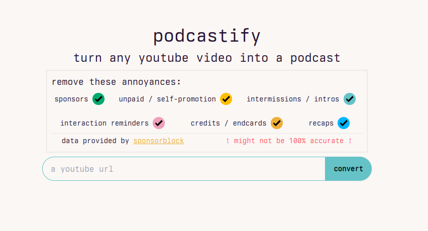
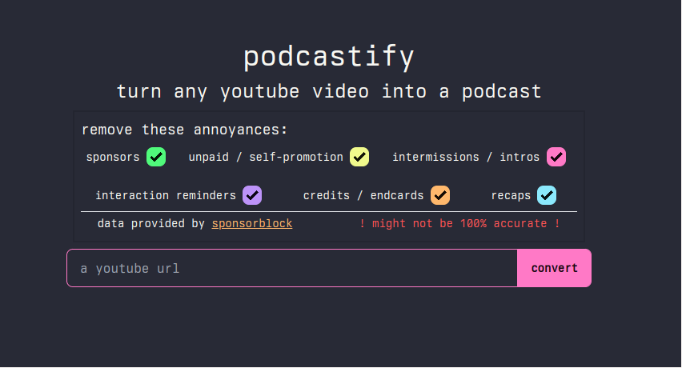

# podcastify

turn youtube videos into podcasts, removing the youtuber's bullshit and keeping the good (?) stuff.

    
    

# how does it work

1. it's just a wrapper around [yt-dlp](https://github.com/yt-dlp/yt-dlp) and [ffmpeg](https://ffmpeg.org/)
2. it works

# demo

please wait a bit, i'm working on it; follow the instructions below to deploy your own
<!-- a demo is available at [podcast.mana.rip](https://podcast.mana.rip), but it's not guaranteed to be up at all times. -->

# deploy your own

> [!NOTE]
> compiled css files are provided, but you can compile them by running `yarn run tailwind -w -i tw.css -o ../static/main.css -m` from the `src` directory, also i used `yarn` but use whatever's compatible with `"daisyui": "^4.10.2"` & `"tailwindcss": "^3.4.3"` idk

> [!IMPORTANT]
> i used go 1.22.2 to code that, but it should work with (a lot) of older versions

1. clone this repository
2. build using `go build`
3. copy the `.env.example` file to `.env` and change the values to your liking
4. run `podcastify` and you have your own

| variable | type | description |
| --- | --- | --- |
| `PORT` | `int` | port to listen on |
| `BIND_ADDRESS` | `int` | address to bind to |
| `MODE` | `development` or `production` | if `production` the templates are not reloaded |
| `PODCAST_ROOT_PATH` | `int` | path to store the audio files |
| `MAX_VIDEO_LENGTH` | `int` | maximum video length in seconds |
| `EXPIRATION_TIME` | `int` | time in seconds before the audio files are removed |

# contributing

this thing was written in an hour, add whatever you want as long as it remains easy to use

# cool things

1. it uses 64kbps vorbis audio which should be enough for multiple speakers + background music
2. audio files are removed after 6 hours
3. videos >4 hours are not allowed because i don't want to pay for storage (but you can change that the `.env` file)

# collected data

here's all the things collected by the server:

# dependencies

- [yt-dlp](https://github.com/yt-dlp/yt-dlp)
- [ffmpeg](https://ffmpeg.org/)
- [tailwindcss](https://tailwindcss.com/)
- [daisyui](https://daisyui.com/)
- [htmx](https://htmx.org/)
- [hyperscript](https://hyperscript.org/)

also it has a dark/light mode support and i think that's pretty cool

oh and it should be accessible, but i'm not sure about if it's not please open an issue (or a pull request)